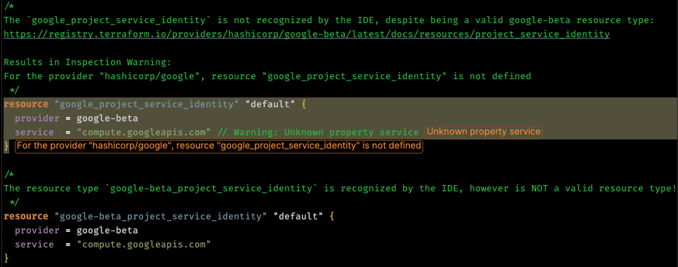

# Jetbrains IDE Google Cloud Terraform Beta Provider Confusion Example

The JetBrains [Terraform/OpenTofu Plugin](https://www.jetbrains.com/help/idea/terraform.html) gets confused when dealing with Terraform resources using the Google Cloud Beta provider (`google-beta`). 

For a specific example, the plugin fails to recognize the `google-beta_project_service_identity` resource type, 
leading to an `Invalid resource type` error.

```terminal
$ tofu validate -no-color

Error: Invalid resource type

  on main.tf line 5, in resource "google-beta_project_service_identity" "default":
   5: resource "google-beta_project_service_identity" "default" {

The provider hashicorp/google-beta does not support resource type
"google-beta_project_service_identity".
```


